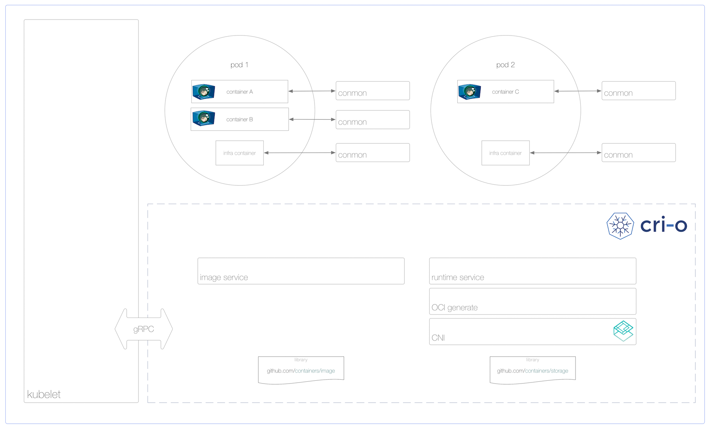

{:.features}
* **Designed**: Optimized for Kubernetes
* **Stable**: Committed to passing Kubernetes tests
* **Any Image from Any Registry**: pull from *any* [compliant registry](#container-images); run *any* [OCI-compliant container](#oci-compatible-runtimes)

## Try Now

* Using `kubeadm`: Follow [cri-o Ansible](https://github.com/cri-o/cri-o-ansible) installation
* **Minikube** integration in progress

### Distribution Packaging

* **Fedora**: Available on Fedora 25, 26 and Rawhide

    dnf install cri-o
* **Ubuntu**: Available as a [PPA](https://launchpad.net/~projectatomic/+archive/ubuntu/ppa)
* **RHEL7**: Soon
* **Centos**: Soon

Join #cri-o on IRC (freenode)

### CRI-O Running Kubernetes Pods

## What is CRI-O?

CRI-O is an implementation of the Kubernetes CRI (Container Runtime Interface) to enable using
OCI (Open Container Initiative) compatible runtimes.
It is a lightweight alternative to using Docker as the runtime for kubernetes.
It allows Kubernetes to use any OCI-compliant
runtime as the container runtime for running pods. Today it supports runc and Clear Containers
as the container runtimes but any OCI-conformant runtime can be plugged in principle.

CRI-O supports OCI container images and can pull from any container registry.
It is a lightweight alternative to using Docker, Moby or rkt as the runtime for Kubernetes.

## Contributors

CRI-O is a community-driven, open source project. Feedback, users, and of course, contributors, are always welcome at the [kubernetes-incubator/cri-o](https://github.com/kubernetes-incubator/cri-o) project. CRI-O is developed by maintainers and contributors from these companies and others.

{:.contributors}
* {:.contributor} Red Hat
* {:.contributor} Intel
* {:.contributor} SUSE
* {:.contributor} Hyper
* {:.contributor} IBM

## Architecture

The architectural components are as follows:

- Pods live in a `cgroups` slice and hold shared IPC, net and PID `namespaces`.
- The root filesystem for a container is generated by the containers/storage library when CRI CreateContainer/RunPodSandbox APIs are called.
- Each container has a monitoring process, `conmon` that receives the master pseudo-terminal `pty`, copies data back and forth between master/slave `pty` pair, handles logging for the container and records the exit code for the container process.
- The CRI Image API is implemented using the `containers/image` library.
- Networking for the pod is setup through use of [CNI](https://github.com/containernetworking/cni), so any CNI plugin can be used with CRI-O.

## Components

CRI-O is made up of several components that are found in different GitHub repositories.

* [OCI compatible runtime](https://github.com/opencontainers/runtime-tools)
* [containers/storage](https://github.com/containers/storage)
* [containers/image](https://github.com/containers/image)
* [networking (CNI)](https://github.com/containernetworking/cni)
* [container monitoring (conmon)](https://github.com/kubernetes-incubator/cri-o/tree/master/conmon)
* security is provided by several core Linux capabilities

### OCI compatible runtimes

CRI-O supports any [OCI compatible runtime](https://github.com/opencontainers/runtime-tools).
We test with runc and Clear Containers today.

### Storage

The [containers/storage](https://github.com/containers/storage) library is used for managing layers
and creating root file-systems for the containers in a pod: `Overlayfs`, `devicemapper`, `AUFS` and `btrfs`
are implemented, with `Overlayfs` as the default driver.

Support for network based file system images (NFS, Gluster, Cefs) is on the development roadmap.

### Container images

The [containers/image](https://github.com/containers/image) library is used for pulling images from registries.
Currently, it supports Docker [schema 2/version 1](https://docs.docker.com/registry/spec/manifest-v2-1/)
as well as [schema 2/version 2](https://docs.docker.com/registry/spec/manifest-v2-2/).
It also passes all Docker and Kubernetes tests.

### Networking
The Container Network Interface [CNI](https://github.com/containernetworking/cni) is used for setting up networking for the pods.
Various CNI plugins such as Flannel, Weave and OpenShift-SDN have been tested with CRI-O and are working as expected.

### Monitoring

[conmon](https://github.com/kubernetes-incubator/cri-o/tree/master/conmon) is a utility within CRI-O that is used to
monitor the containers, handle logging from the container process, serve attach clients and detects Out Of Memory (OOM)
situations.

### Security

Container security separation policies are provided by a series of tools including SELinux, Capabilities, seccomp,
and other security separation policies as specified in the OCI Specification.

<a class="twitter-timeline"  href="https://twitter.com/hashtag/%22cri-o%22" data-widget-id="862337196434632704">#"cri-o" Tweets</a>

